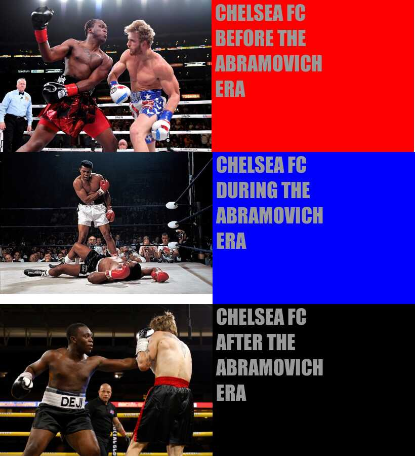

**Stats 220 - Data Technologies(Assignment 1)**

The meme below was created to using R code. More specifically, the magick package available in the R library.

The meme plays on the a current convention on the internet to compare the life cycle of a range of topics (often between 3 - 5 stages) and uses images to describe the state of the topic at a particular point.

The current Russia-Ukraine crisis has had a huge effect on Chelsea Football Club in the English Preimer league due to its Russian ownership. As a current giant in the football world, the meme compares Chelsea before their Russian ownership and makes a prediction for the  clubs future due to sactions currently imposed by the British government on its the clubs Russian owner.

*Below is the meme and the R code used to create it*

```r
library(magick)
top_part_of_meme <- c(image_read("https://imageio.forbes.com/specials-images/imageserve/1186834489/0x0.jpg?format=jpg&width=1200&fit=bounds"))

top_part_of_meme <- image_scale(top_part_of_meme,"x300")

first_text <- c(image_blank( width = 400,
                           height = 300,
                           color = "red"))

first_text <- image_annotate(first_text, " CHELSEA FC\n BEFORE THE\n ABRAMOVICH\n ERA",
                 color = "#999999",
                 size = 40,
                 font = "Impact")

first_meme <- c(top_part_of_meme, first_text)

first_stack <- image_append(first_meme)


middle_part_of_meme <- c(image_read("https://img.washingtonpost.com/rf/image_606w/2010-2019/WashingtonPost/2016/06/04/Web-Resampled/2016-06-04/1368864311465001651-kCMG--606x404@wp.com.jpg"))
middle_part_of_meme <- image_scale(middle_part_of_meme, "x280")


second_text <- c(image_blank( width = 400,
                              height = 300,
                              color = "blue"))
second_text <-  image_annotate(second_text, " CHELSEA FC\n DURING THE\n ABRAMOVICH\n ERA",
                                color = "#999999",
                                size = 40,
                                font = "Impact")
second_meme <- c(middle_part_of_meme, second_text)
second_stack<- image_append(second_meme)


bottom_part_of_meme <- image_read("https://talksport.com/wp-content/uploads/sites/5/2022/03/GettyImages-1323269785.jpg?strip=all&quality=100&w=960") %>% image_scale(420)

third_text <- image_blank( width = 400,
                              height = 300,
                              color = "#000000") %>% 
  image_annotate(" CHELSEA FC\n AFTER THE\n ABRAMOVICH\n ERA",
                                color = "#999999",
                                size = 40,
                                font = "Impact")
third_meme <- c(bottom_part_of_meme, third_text)
third_stack <- image_append(third_meme)

final_meme <- c(first_stack, second_stack, third_stack)
final_stack <- image_append(final_meme, stack = TRUE)
print(final_stack)
image_write(final_stack, "my_meme.png")


```



